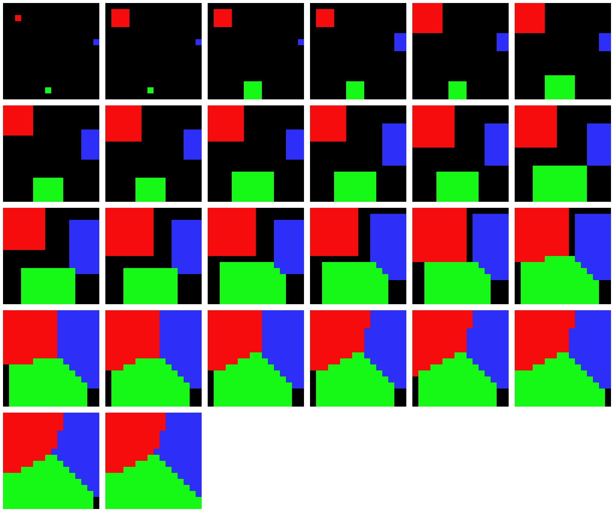

# Generating Voronoi diagram

### Introduction

Voronoi diagram is a partition of a multi dimension space into regions based on distance to points in a specific subset of the space. The set of points (also called seeds, sites, or generators) is specified beforehand, and for each point there is a coresponding space region with the property that all the points in that region is closer to it's seed than to any other. This regions are called Voronoi cells.

Most general space used for Voronoi diagrams it's the 2D space, having multiple applications in various domains.

#### Generating Voronoi diagrams in 2D space _(possible also 3D space)_

##### Input data (_files_)
 - __X, Y__: dimension of the 2D space (for simplicity __X__ and __Y__ will be equal)
 - __n__: unsigned integer representing the number of seeds
 - on the following __n__ lines there are pairs of __x, y__ representing the position of the seeds in the _application space dimension_
 
The __application space dimension__ it's the space with the constrains that __x__ is an integer in [0, __X__] and __y__ is an integer in [0,__Y__]

##### Output
An image representing the Voronoi diagram, using as distancefunction the euclidian distance.
*also for debug purpose(and maybe easy comparison of results between different implementations) there might be an aditional output file.

#### Sequence implementation algorithm
For the sequence implementation I choose to use the classic flood fill algorithm. The ideea of this algorithm is we put the seeds in a queue, and while there are elements in the queue. we take the first element from the queue(will name it _current element_), go to it's neighbours (if the _current element_ is at $<x, y>$ position, we go to: $<x+i, y+j>$ where $i, j \in \{-1, 0, 1\}$ and name it _next element_). If the _next element_ doesn't have a seed or if the distance between the _next element_ and it's associated seed is greater than the _next element_ and the seed of the _current element_ then the seed of the _next element_ is change to the seed of the _current element_, and put the _next element_ at the back of the queue.
Example of the sequence implementaion:

#### Multithreading implementation algorithm
For the multithreading implementation I choose to use a modified version of Jump Flooding Algorithm (aka JFA). This algorithm it's somehow simmilar with the classical flood fill algorithm, but has much better performance, because was design to be used on GPUs and that's why this implementation is a modified version of JFA. The ideea behind JFA is that instead of going to the neighbourn elements (the distance between _current element_ and _next element_ is 1), we choose the _next element_ in the following way: for each _current element_ at $<x, y>$ the _next element_ is positioned at $<x+i, y+j> where\ i, j \in \{-k, 0, k\}$ and $k$ takes values from $\frac{X}{2}, \frac{X}{4}, ..., 2, 1$ ($X$ is the space dimension of the 2D plan and it's supposed to be equal with __Y__. In addition __X__ is choose to be a power of 2). This little change grant's us the posibility to fill more tiles with only $\log_2 X$ steps instead of __X__.

To do this in a multithreading way, there will be __n__ _work jobs_, each _work job_ having an associated seed. For every _work job_ we apply the JFA algorithm explain above. These _work jobs_ will run on a differents threads assigned from a thread pool wich will have a size equal with the number of logical proccesors. This means that the _work jobs_ will run asynchronous. Because each time we do a flood we need to be sure that all the _work job_ are at the same value of _k_ we will have a barrier with will synchronize the _work jobs_. In addition of this we need to make sure that there will not be a race condition between threads when 2 or more threads want to modify the same element. To prevent this race condition, each element will be guarded by a mutex.

###### WT description
	Input: - Matrix s[0..X][0..X] shared memory(space matrix)
	       - Tile s(seed position)
	       - int k (step size)
	Output: updated matix space

	local queue q1,q2
	local bool done = false
	q1.push(s)

	while(!done):
		while(!q1.empty()):
			Tile c_t = q.pop()
			for Tile t in next_tiles(c_t):
				if update(t, c_t):
					q2.push(t)
		q1 = q2
		barrier() | <-- wait for all threads here
		done = next_step(k) | <-- only one thread will update k

## TODO exemple image after implementation